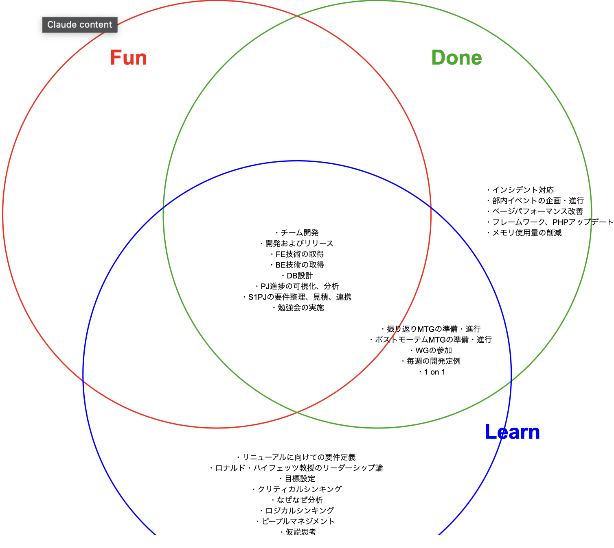

## はじめに
2023年7月から株式会社よりそうにてエンジニアとして働いています。
 よりそうで1年半ほど経ち、エンジニアとして働き始めてからは4年経ちました。
 できるようになったことを中心に自分を褒めてあげる振り返りにしています。こういう振り返りもあって良いんだという例になればと思います。

## Fun/Done/Learn
振り返りの手法は、<a class="link link-info" href="https://qiita.com/viva_tweet_x/items/7e279f41f4388d9162ef">Fun/Done/Learn</a>を使ってみました。
 最初はKPTで書き始めたんですが、どうしても課題に目が行きがちで。それなら楽しかったことや頑張ったことをちゃんと残せる方法にしようと思い、Fun/Done/Learn で整理してみることにしました。

## 開発・技術面での成長
今年は技術的な成長を実感できた年でした。

フロントエンド、バックエンド両方の技術を習得し、DB設計からプロジェクト進捗の可視化・分析まで、開発の幅広い工程に関わることができました。
特に嬉しかったのは、これらの活動が「楽しみながら」「実際に成果を出しながら」「新しい学びを得ながら」進められたことです。

技術習得においては、チームでの開発を通じて効率的に学ぶことができました。

## チーム開発
前の会社では経験できなかったチーム開発を経験できました。

率先してチームのパフォーマンスを発揮するために進捗状況の可視化や傾向の分析を行ったのですが、結構好きな作業でした。
周りのリーダーシップを持った仲間に影響を受けながら、チームの課題やメンバーの課題などにも意識が向くようになり、少しずつですが挑戦できるようになったと思います。

また、コミュニケーションの取り方にもたくさん方法があることを学び、改善を重ねながら実施できたと思っています。

## 新しい学びと挑戦
技術面の成長に加えて、今年はビジネス周りのスキルについても色々と学ぶ機会がありました。

### マネジメントとリーダーシップ
ロナルド・ハイフェッツのリーダーシップ論はとても印象に残っています。
役職を与えられているからリーダーシップが必要、なんて考えをしていましたが、変革を起こすための行動そのものがリーダーシップだと学びました。

まだまだ実践できてるとは言えませんが、日々の仕事の中でこの考え方を意識するようになってきています。

### 論理的思考と問題解決
クリティカルシンキングやロジカルシンキング、なぜなぜ分析、仮説思考など、色々な考え方を学びました。
問題の本質を捉えて根本的な原因に対処する、という基本的な考え方は理解できたかなと思います。

これからは実際の業務でも使っていけるように、身近なところから少しずつチャレンジしていきたいです。

### ピープルマネジメント
チーム開発を通じて、技術面だけじゃなく「人」との関わり方についても考えるようになりました。
毎週の定例や普段のやり取りを通じて、チームをうまく機能させるためのヒントをたくさんもらえた気がします。

まだ学び始めたばかりですが、これからのキャリアを考えると、すごく大切な経験になりそうです。

### これからの目標
来年は、今年学んだことを少しでも実践に移していきたいです

- 学んだ理論を活かせそうな場面を見つけたら積極的にチャレンジ
- できることから少しずつトライ
- 失敗を恐れずにやってみる！

技術
- アウトプット量を増やす
- ネットワークやクラウドサービスの知識をつける

理想と現実のギャップに戸惑うこともありそうですが、一歩一歩進んでいければと思います。

## 感謝
刺激をくれる同僚や、気づきを与えてくれる上司の方々のおかげで成長を感じることができた年でした。
本当にありがとうございます。

## その他
### 旅行した場所
- 神奈川
    - 猿島
    - 江ノ島
    - 鎌倉
- 群馬
    - 世界の名犬牧場
    - シマブルー
- 静岡
    - 熱海
- 大阪
    - USJ
    - 鶴橋
    - 大阪くらしの今昔館
- 京都
    - 伏見
    - 宇治
- 八景島シーパラダイス

### 演奏
- 打首獄門同好会ツアーファイナル

